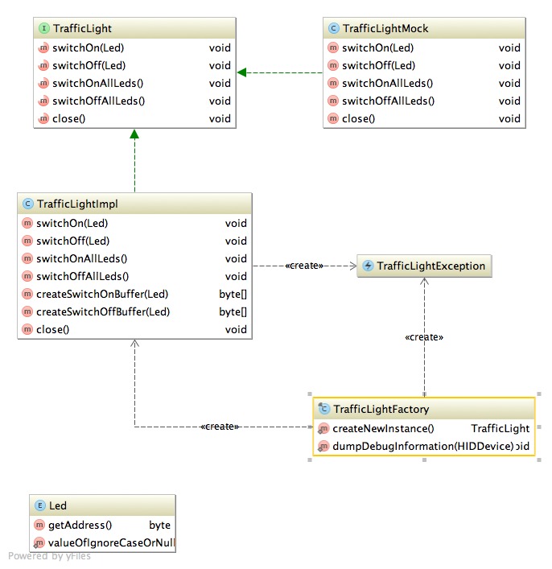
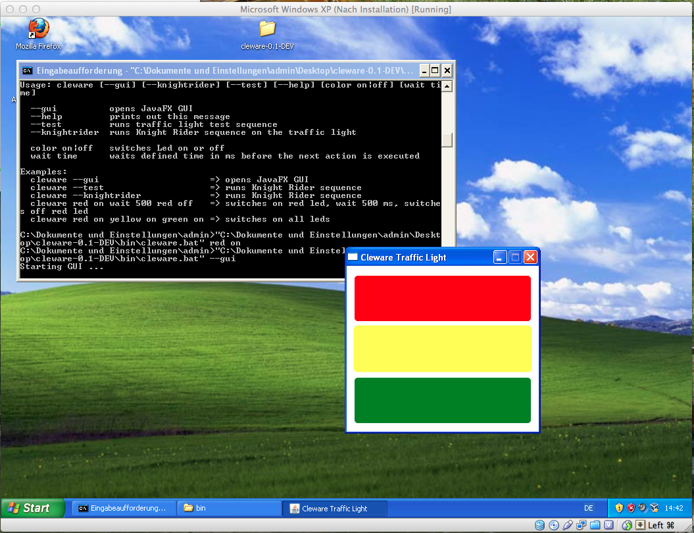

Build Light
===========

Continuous Delivery is a pattern language used in software development to automate and improve the process of
software delivery. Techniques such as automated testing, continuous integration and continuous deployment allow
software to be developed to a high standard and easily packaged and deployed to test environments.


Continuous delivery treats the commonplace notion of a deployment pipeline: a set of validations through
which a piece of software must pass on its way to release. Code is compiled if necessary and then packaged by a
build server every time a change is committed to a source control repository, then tested by a number of different
techniques before it can be marked as releasable. It is important to understand that any code commit may be released to
customers at any point.

What is Build Light
-------------------

The article [Using a Raspberry PI to control an extreme feedback device](http://blog.codecentric.de/en/2013/07/using-a-raspberry-pi-to-control-an-extreme-feedback-devices/)
has inspired me to buy a traffic light in the [Cleware Shop](http://www.cleware-shop.de/).


### Installation ###

* [Windows Download](http://h1994633.stratoserver.net:9090/job/Build-Light/lastSuccessfulBuild/artifact/app/buildlight/build/distributions/buildlight-1.1-DEV.zip)
* [Linux/Mac Download](http://h1994633.stratoserver.net:9090/job/Build-Light/lastSuccessfulBuild/artifact/app/buildlight/build/distributions/buildlight-1.1-DEV.tar)
* [RaspberryPI Download](http://h1994633.stratoserver.net:9090/job/Build-Light/lastSuccessfulBuild/artifact/app/buildlight-pi/build/distributions/buildlight-pi-1.1-DEV.tar)

#### Installation Linux/Mac ####

```bash
berndzuther@Bernds-MacBook-Pro ~/Downloads$ tar xvf buildlight-0.1-DEV.zip
berndzuther@Bernds-MacBook-Pro ~/Downloads$ cd buildlight-0.1-DEV/bin
berndzuther@Bernds-MacBook-Pro ~/Downloads$ ./buildlight
```

#### Installation RaspberryPI ####

```bash
pi@raspberry ~$ sudo apt-get install libusb-1.0-0 openjdk-7-jdk
pi@raspberry ~/Downloads$ tar xvf buildlight-0.1-DEV.zip
pi@raspberry ~/Downloads$ cd buildlight-0.1-DEV/bin
pi@raspberry ~/Downloads$ sudo ./buildlight
```

### Configuration ###

#### Jenkins ####

[](http://youtu.be/ArT32kL_j9g)

#### Bamboo ####

[](http://youtu.be/IfQtBqZTjnQ)

Cleware Traffic Java Driver
---------------------------

### Use Cleware Traffic Driver in our Application ###

[](picture/classdiagram.png)

#### Maven ####
```java
<dependency>
  <groupId>com.comsysto.buildlight</groupId>
  <artifactId>cleware-driver</artifactId>
  <version>1.0</version>
</dependency>
```
#### Gradle ####
```groovy
compile "com.comsysto.buildlight:cleware-driver:1.0"
```
#### Java ####
```java
public class TrafficLightFactoryTest {
    public static void main(String[] args) {
        TrafficLight light = TrafficLightFactory.createNewInstance();
        light.switchOn(Led.RED);
        light.switchOffAllLeds();
        light.close();
    }
}
```

### Installation of the commandline tool ###

* [Windows Download](http://h1994633.stratoserver.net:9090/job/Build-Light/lastSuccessfulBuild/artifact/driver/cleware/build/distributions/cleware-0.1-DEV.zip)
* [Linux/Mac Download](http://h1994633.stratoserver.net:9090/job/Build-Light/lastSuccessfulBuild/artifact/driver/cleware/build/distributions/cleware-0.1-DEV.tar)
* [RaspberryPI Download](http://h1994633.stratoserver.net:9090/job/Build-Light/lastSuccessfulBuild/artifact/driver/cleware-pi/build/distributions/cleware-pi-0.1-DEV.tar)

```bash
berndzuther@Bernds-MacBook-Pro ~/Downloads$ tar xvf cleware-0.1-DEV.zip
berndzuther@Bernds-MacBook-Pro ~/Downloads$ cd cleware-0.1-DEV/bin
berndzuther@Bernds-MacBook-Pro ~/Downloads$ ./cleware --gui
```


