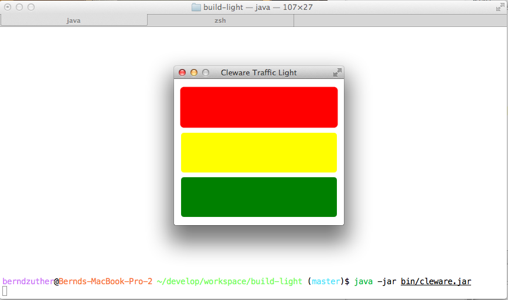

Build Light
===========

Continuous Delivery is a pattern language used in software development to automate and improve the process of
software delivery. Techniques such as automated testing, continuous integration and continuous deployment allow
software to be developed to a high standard and easily packaged and deployed to test environments, resulting in
the ability to rapidly, reliably and repeatedly push out enhancements and bug fixes to customers at low risk and
with minimal manual overhead.


Continuous delivery treats the commonplace notion of a deployment pipeline: a set of validations through which a piece
of software must pass on its way to release. Code is compiled if necessary and then packaged by a build server
every time a change is committed to a source control repository, then tested by a number of different techniques
before it can be marked as releasable.

Developers used to a long cycle time may need to change their mindset when working in a Continuous Delivery environment.
It is important to understand that any code commit may be released to customers at any point.

What is Build Light
-------------------

[](youtube-ArT32kL_j9g-722x542)

Cleware Traffic Java Driver
---------------------------

### Installation ###

<a rel="nofollow" title="Download this repository as a zip file" class="minibutton" href="http://h1994633.stratoserver.net:9090/job/Build-Light/lastSuccessfulBuild/artifact/driver/cleware/build/distributions/cleware-0.1-DEV.zip">
    <span class="octicon octicon-cloud-download"></span>
    Download ZIP
</a>

```bash
berndzuther@Bernds-MacBook-Pro ~/Downloads$ unzip cleware-0.1-DEV.zip
Archive:  cleware-0.1-DEV.zip
   creating: cleware-0.1-DEV/
   creating: cleware-0.1-DEV/lib/
  inflating: cleware-0.1-DEV/lib/cleware-0.1-DEV.jar
  inflating: cleware-0.1-DEV/lib/jfxrt.jar
  inflating: cleware-0.1-DEV/lib/slf4j-api-1.7.5.jar
  inflating: cleware-0.1-DEV/lib/logback-classic-1.0.13.jar
  inflating: cleware-0.1-DEV/lib/groovy-all-2.1.6.jar
  inflating: cleware-0.1-DEV/lib/commons-lang-2.6.jar
  inflating: cleware-0.1-DEV/lib/commons-io-2.4.jar
  inflating: cleware-0.1-DEV/lib/spring-core-3.2.3.RELEASE.jar
  inflating: cleware-0.1-DEV/lib/spring-beans-3.2.3.RELEASE.jar
  inflating: cleware-0.1-DEV/lib/spring-context-3.2.3.RELEASE.jar
  inflating: cleware-0.1-DEV/lib/spring-context-support-3.2.3.RELEASE.jar
  inflating: cleware-0.1-DEV/lib/hidapi-1.1.jar
  inflating: cleware-0.1-DEV/lib/logback-core-1.0.13.jar
  inflating: cleware-0.1-DEV/lib/commons-logging-1.1.1.jar
  inflating: cleware-0.1-DEV/lib/aopalliance-1.0.jar
  inflating: cleware-0.1-DEV/lib/spring-aop-3.2.3.RELEASE.jar
  inflating: cleware-0.1-DEV/lib/spring-expression-3.2.3.RELEASE.jar
   creating: cleware-0.1-DEV/bin/
  inflating: cleware-0.1-DEV/bin/cleware
  inflating: cleware-0.1-DEV/bin/cleware.bat
berndzuther@Bernds-MacBook-Pro ~/Downloads$ cd cleware-0.1-DEV/bin
berndzuther@Bernds-MacBook-Pro ~/Downloads$ ./cleware

Cleware Traffic Light Java Driver, Maintained by B. Zuther.
Send bug reports using https://github.com/zutherb/build-light/issues

Usage: cleware [--gui] [--knightrider] [--test] [--help] [color on|off] [wait time]

  --gui          opens JavaFX GUI
  --help         prints out this message
  --test         runs traffic light test sequence
  --knightrider  runs Knight Rider sequence on the traffic light

  color on|off   switches Led on or off
  wait time      waits defined time in ms before the next action is executed

Examples:
  cleware --gui                     => opens JavaFX GUI
  cleware --test                    => runs Knight Rider sequence
  cleware --knightrider             => runs Knight Rider sequence
  cleware red on wait 500 red off   => switches on red led, wait 500 ms, switches off red led
  cleware red on yellow on green on => switches on all leds

berndzuther@Bernds-MacBook-Pro ~/Downloads$ ./cleware --gui
```


